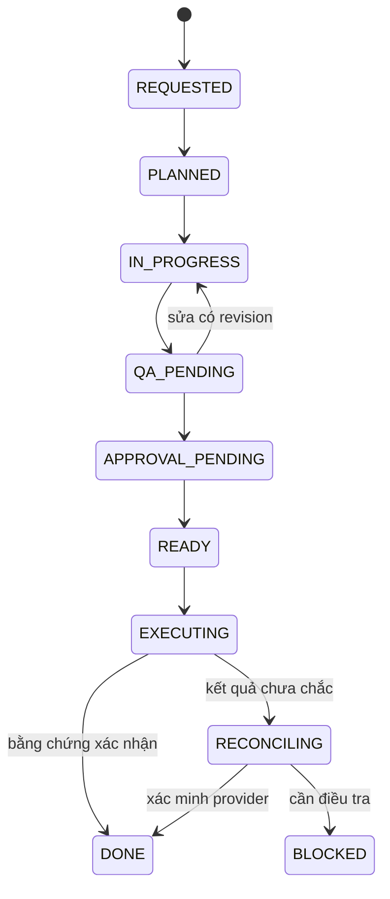

# 04 · Operating system và Work Orders

## Cấp kế hoạch

Objective là outcome của công ty; initiative là một giả thuyết có ngân sách/thời hạn; Work Order (WO) là đơn vị có thể giao, kiểm định và đối soát. Task con không được làm rộng scope hay lách quota của WO cha. CEO tạo portfolio, Governance kiểm tra quyền, Finance giữ cost envelope, các phòng ban nhận WO.

## Bản ghi WO

Contract tối thiểu trong [schema](../schemas/work-order.schema.json): id, version, objective_id, action, assigned_to, requested_by, environment, policy_version, status, created_at, expires_at, idempotency_key, input_refs, artifact_digest, dependencies, acceptance_criteria và max_cost_vnd.

Production cần thêm revision/row_version, lease_owner/lease_until, retry count/next_attempt, target/payload digest, risk tier, approval refs, evidence refs, reserved budget, correlation ID và cancellation reason. Không coi schema bootstrap đã cung cấp database/locks.

Mỗi input ref phải định danh nguồn và digest/version, không chỉ URL tới main mutable. Không chứa token hay order PII trong WO. acceptance_criteria phải đo được: "3 draft đúng schema và không có claim chưa duyệt", không phải "làm hay nhất".

## State machine

BLOCKED/CANCELLED/FAILED là nhánh dừng có lý do từ trạng thái phù hợp. DONE/CANCELLED không tự mở lại; tạo WO/revision mới. Với internal draft, toolkit offline cho phép QA_PENDING → DONE khi reviewer ghi bằng chứng kiểm tra nội bộ. Không cho external WO đi tới EXECUTING/DONE trong toolkit này.

READY không có nghĩa published. Provider trả ID chưa chắc media đã render; cần trạng thái cuối và content match. DONE cần outcome, evidence URI/digest và reviewer, không phải chỉ stdout "success".

## Idempotency và lease

Key xác định một logical side effect: action + target + payload revision. Retry cùng mutation giữ key; thay payload tạo revision/key mới sau approval. Không tái sử dụng key cũ cho payload khác. Key cục bộ không có nghĩa Meta hỗ trợ exactly-once.

Production durable queue phải unique index theo environment+action+key, row version CAS, lease renewal/fencing token và atomic reservation. Worker chết sau provider success trước ghi DB → UNKNOWN/RECONCILING. GET/search theo provider correlation và artifact identity trước khi quyết định gửi lại. Không có phép khẳng định exactly-once qua mạng chỉ bằng file lock.

## Handoff và artifact bundle

Một bundle gồm brief, copy/script, source manifest, claim references, asset rights, media checksums, QA findings, authorization request, signed receipt khi live, publish request, provider receipt, reconciliation record và metric snapshots. Draft chưa có media thật phải ghi media=null và BLOCKED, không dựng đường dẫn file tồn tại giả.

QA phải kiểm tra cả caption/link/CTA/alt text/schedule/account target, không chỉ ảnh. Tất cả bytes định gửi được khóa theo digest; đọc lại và kiểm tra tại execution để tránh TOCTOU. Người sửa nội dung phải tạo revision và QA lại.

## Retry, timeout và DLQ

Đề xuất mặc định cho local orchestration: tối đa 2 lần repair nội dung, 3 lần retry lỗi tạm đã xác nhận chưa tạo tác động; backoff có jitter, tối đa 60 giây mỗi lần, deadline WO là giới hạn cuối. Đây là policy nội bộ có thể phê duyệt lại, không phải quota Meta.

401/403, invalid credential, permission, policy fail, thiếu rights, malformed input: không retry để lách. 429: tôn trọng Retry-After/quota; nếu response mutation không rõ vẫn phải reconcile. DLQ lưu reason code và reference đã redacted, không dump raw customer payload. Replay DLQ cần quyền lại, không giữ approval hết hạn.

## Cadence điều hành

Hằng ngày: kiểm tra MONEY/GROWTH/RISK và incident trước → đóng WO cũ → chọn tối đa WIP đã cho phép → sản xuất/review → ghi kết quả thật. Hằng tuần: review hypotheses, unit economics, customer feedback, experiment và blocker; phân bổ nguồn lực mới qua policy. Hằng tháng: kiểm định nguồn, quyền, retention, financial close, agent eval và roadmap.

Cadence là SOP; repo chưa cài cron hoặc worker chạy liên tục. Không tuyên bố "đang tự vận hành mỗi ngày" khi không có scheduler deployment evidence.

## Acceptance và bàn giao

WO chỉ DONE khi đạt từng criterion và có file/chứng từ thật. Test thất bại hoặc chưa chạy ghi riêng. Handoff report gồm state, changes, tests, external effects, costs, risks, owner decisions và next independent work. Không báo phần trăm nếu không có denominator.

Từ chối cycle dependency, orphan objective, missing actor, expiry, cost âm, unknown action/status. Khi dừng toàn cục: giữ queue và evidence, không xóa jobs để dashboard xanh.

Xem [work orders triển khai](../../docs/implementation/work-orders.md) và [dependency map](../../docs/implementation/dependency-map.md).
