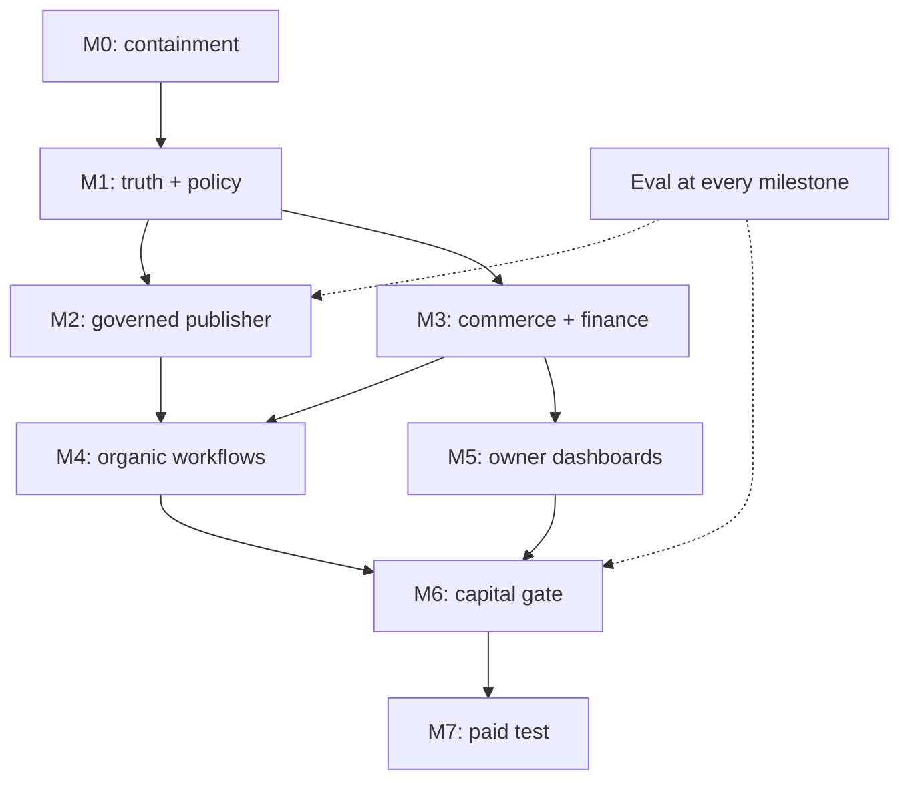

# Dependency map

Arrows are launch dependencies, not proof of completion. Organic planning/eval fixtures can run offline while production dependencies are blocked. Paid transport must not exist as an uncontrolled alternate path.

Cross-cutting controls: Owner policy, source/rights/consent, secrets/signers, schema validation, audit, durable idempotency/reservations and incident recovery. Missing safety boundary stops dependent external work but does not stop independent internal documentation/tests.
